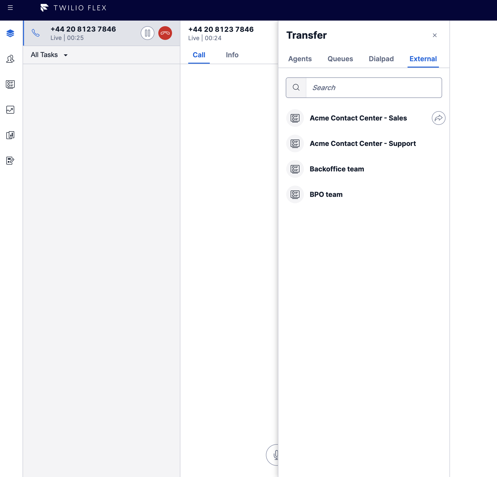
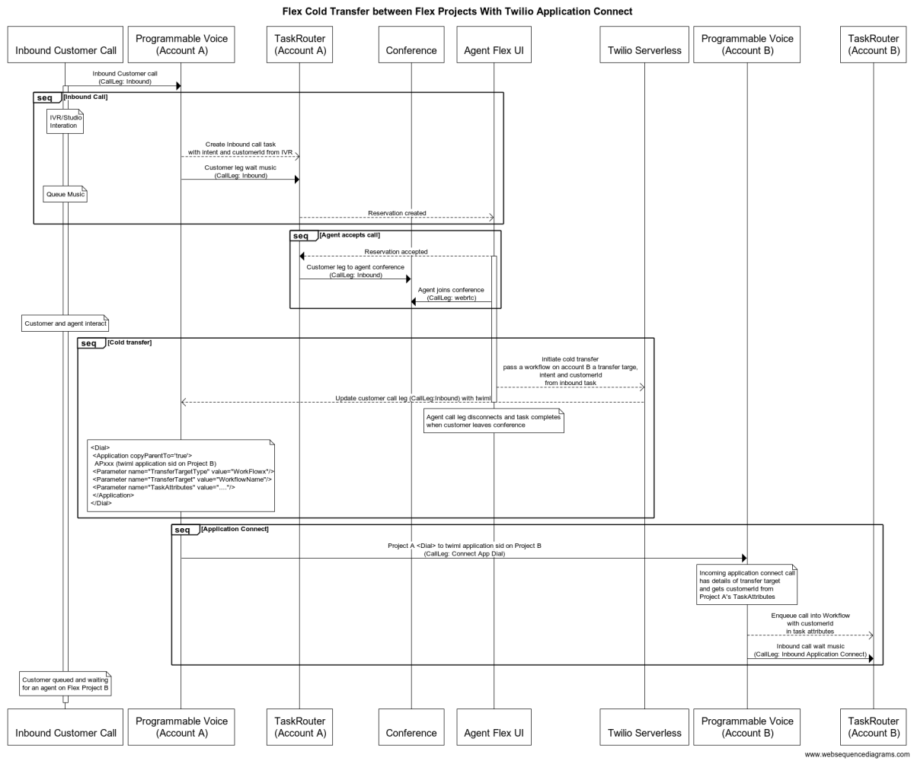

# Flex Plugin for Twilio Application Connect

## Disclaimer

**This software is to be considered "sample code", a Type B Deliverable, and is delivered "as-is" to the user. Twilio bears no responsibility to support the use or implementation of this software.**

**Application Connect is in beta at the time of publishing this Flex Plugin. Stay tuned for updates and for links to documentation.**

## Pre-Requisites

**This plugin makes use of Paste in Flex and React Hooks which is a dependency on Flex 2.x**

## Overview

This plugin is intended to demonstrate how Twilio Application Connect can be used to transfer a call from one Flex Project to another whilst passing context for the call.

Without Application Connect this would not have been possible as you would only be able to make an outbound call to the other Flex Project which doesn't allow passing of context.

For example, if you have already identified the caller during the initial IVR phase of the call or frm the agent updating the task then you can pass this context in the call to allow a more efficient customer and agent experience.

Transfering of a call to another project could also be done whilst the call is still in the TaskRouter workflow. This would allow use cases such as overflow. If for example you TaskRouter workflow moved the call to a specific queue you could then transfer the call to another Flex Project that may be better staffed to handle the call.

## Twilio Application Connect Overview

_Application Connect is in beta at the time of publishing this Flex Plugin. Stay tuned for updates and for links to documentation._

> Twilio Application Connect allows you to connect your Twilio Programmable Voice applications directly from one Twilio account to another, without added phone numbers, external call-legs, or complexity, while maintaining valuable call context across the connection, and without unnecessary PSTN/SIP call-legs.

> This will allow you to directly connect between Twilio Applications, rather than requiring you to use a Twilio phone number or external SIP proxy, as had been the case in the past.

Application Connect adds the <Application /> noun to Programmable Voice's <Dial /> verb. This allows for a Twiml Application to be dialled from an active call. In the Flex use case for an agent initiated transfer the customer leg can be updated with:

```
 <Dial><Application>APxxx</Application/></Dial>
```

The APxxx Sid can be a Twiml Application on any account and the incoming voice url would be used to fetch the Programmable Voice instructions on how to handle the call in the new account. In addition to the <Application /> noun <Parameter> elements can be included in the <Dial />. These parameter name/values are made available in the incoming voice url as webhook parameters to provide additional context.

## Plugin Overview

Given the flexibility of how parameters can be passed in the <Dial /> and how the incoming call webhook can be handled there are many options available to implement voice call transfers for Flex.

In this example we will assume that the transferring Flex Project has a plugin that customizes Flex UIs native transfer WorkerDirectory to add a new Tab. The transferring project could have a list of 'connected applications' - for example:

```
{ name: "Acme Contact Center - Sales",
  applicationSid: "APxxx",
  targetType: "StudioFlow",
  target: "SalesFlow"
}
```

This list of connected applications could be fetched from a Twilio serverless Asset via request to a Function. In the case of this POC plugin they are hard coded. The name would be used to populate the transfer list and the application sid, target type and target would be used to populate the <Dial /> instruction. In this POC we demonstrate how the targetType could be a Studio Flow or a TaskRouter Workflow that the incoming call can be <Enqueued /> into.

In addition to the transfer target information that the incoming call handler will have access to this plugin also passes all of the Task Attributes from the Task on the transferring account.



### Incoming call sample code

In this POC we have included an example of how the Twiml Applications incoming voice url can be passed to a Twilio Function. In this POC the function looks at the targetType and target and uses a json config file that would map these to Sid values. In the case of an transfer to a Workflow the incoming call is <Enqueued /> and it will also include the customerId from the transferring accounts Task Attribute in the newly created task.
In the case of the redirect to a Studio Flow the trigger.call parameter on the incoming calls Studio Execution will also include the target attributes and previous Task Attributes.

As noted above this is just one example of how context can be passed from one Flex project to another. In this use case we are assuming that there could be a small number of application sids to transfer to and the target name and type would be looked up in a function. Another approach would be to just diectly point the Twiml Applications incoming voice url to a Studio Flow and use whatever logic is required in the Studio Flow to handle the call.

## Setup

### Configure list of Applications

The list of applications that will be displayed in the transfer list along with the mapping to application sid, targetType and target name is hard coded in [fetchConnectedApps](./src/helpers//fetchConnectedApps.js).

The Sid that these map to are configured in [connectedApplicationConfig](./serverless/connectedApplicationTransfer/assets//connectedApplicationConfig.private.js)

Modify these to match your requirements.

### Serverless

The service has two functions, one is a helper to the Plugin to update the customer call and the other is the incoming call hander sample code.

In practice these would be accessed by different accounts (transferring Flex account and incoming call Flex account) but for simplicity they are both included in one service. You can deploy this service to both Flex Porkect accounts and note the domain of the newly deployed service for plugin and account configuration.

### Plugin

The .env.template file can be renamed to .env and updated with the domain of the service that is hosting the [dialToConnectedApplication](./serverless/connectedApplicationTransfer/functions/dialToConnectedApplication.js) function

### Twilio Console Configuration

Create a Twiml Application and point the incoming voice url to the service domain + [connectedApplicationInboundHandler](./serverless/connectedApplicationTransfer/functions/connectedApplicationInboundHandler.protected.js)

## Sequence Diagram


